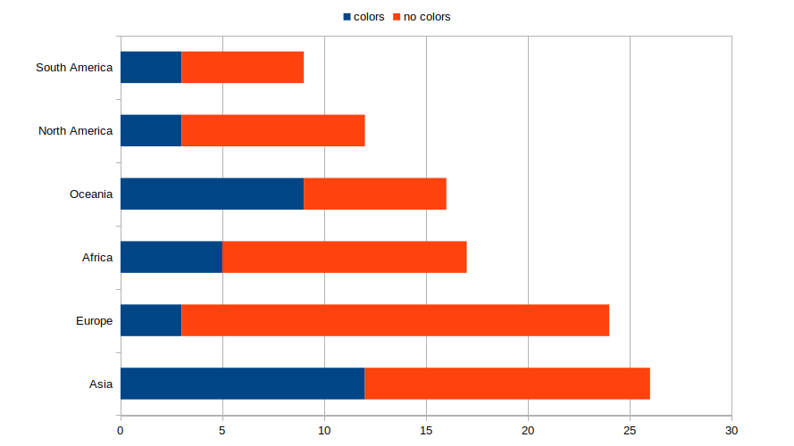
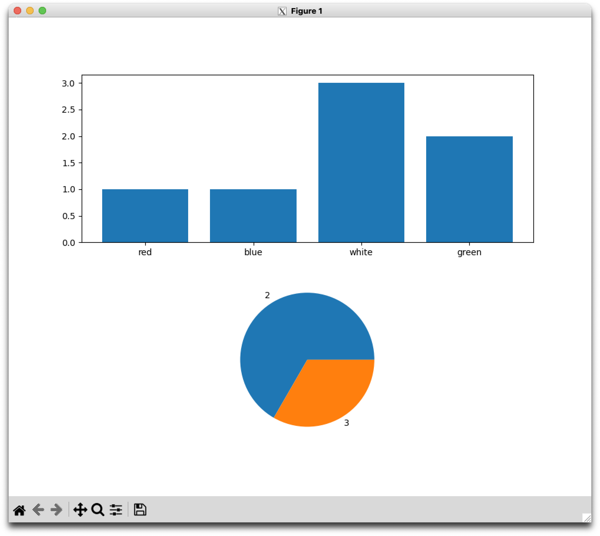

# Fun with flags

Készíts egy grafikus felülettel rendelkező programot, mely országok zászlóiról tart karban egy adatbázist, illetve statisztikákat képes bizonyos paramétereikről készíteni. 

## Kiinduló állapot
Adott egy [JSON fájl](flags.json), melyben az országokról található néhány alapvető információ, valamint egy [könyvtár](flags/), amiben az országok zászlói találhatók SVG illetve GIF formátumban.

## Az elkészítendő alkalmazás funkciói

### Könyvtárválasztás
A program induláskor parancssori argumentumban várja, hogy melyik könyvtárban keresse a `flags` könyvtárat, és a `flags.json` fájlt.
Ha ez nincs megadva, írjon ki a program egy erre utaló hibaüzenetet és lépjen ki.
Ha a megadott elérési út nem létezik, vagy a fenti könyvtár és fájl nem léteznek, akkor egy erre utaló hibaüzenettel álljon le a program.
A fájlról feltételezhető, hogy a formátuma helyes, azaz szintaktikai hibát nem tartalmaz, valamint szerkezete a példában megadottnak felel meg.

### Adattisztítás
Előfordulhatnak a JSON fájlban hiányos országaadatok (nincs meg a `capital`, `continent`, `code`, `name` mindegyike), valamint olyan országok, melyekhez nincs zászló a könyvtárban. Ezeket induláskor azonnal törölje a JSON fájlból. Törölje továbbá azokat a fájlokat a `flags` könyvtárból, melyek nem tartoznak a JSON fájlban megadott (hiánytalan) országokhoz.

### A grafikus felület felépítése
Az alábbi funkciók több ablakba is szétszedhetők, de lehetnek egyben is. Nincs megkötés arra sem, milyen widgetek legyenek használva, csak a funkciók legyenek elérhetők.
1. Látszódjon, hány ország van, és ezek közül hányhoz adottak szín információk 
2. A színinformációval nem rendelkező országok közül válasszon ki egyet tetszőlegesen a program, és jelenítse meg az adatait, valamint a zászlaját.
3. Lehessen valamilyen formában megadni, milyen színek fordulnak elő a zászlón, majd ezt elmenteni. Mentés után jelenítse meg egy másik színinformáció mentes ország adatait.
4. Legyen lehetőség kétféle diagramm elkészítésére:
   1. `progress.png`: Egy bar-ploton mutatja kontinensenként, hogy hány országhoz vannak már meg a szín információk, és hányhoz nincsenek.
   2. `colors.png`: Két diagrammon ad információt a színinformációkkal már kiegészített zászlókról. Az elsőn színek szerint mutatja meg egy bar-ploton, hogy hány zászlón fordulnak elő. A másodikon egy torta diagrammon mutatja meg, hogy az országok zászlóinak hány része 1, 2, 3, 4, stb. színű.

## Megjegyzések
 - Szabadon választható, hogy az SVG vagy GIF fájlokat használja valaki. Amelyiket nem, azokat értelemszerűen törli a tisztító lépés.
 - Minta [progress.png](progress.png) szerkezetére (számadatok nem valósak)
 
 - Minta [colors.png](colors.png) szerkezetére 
 